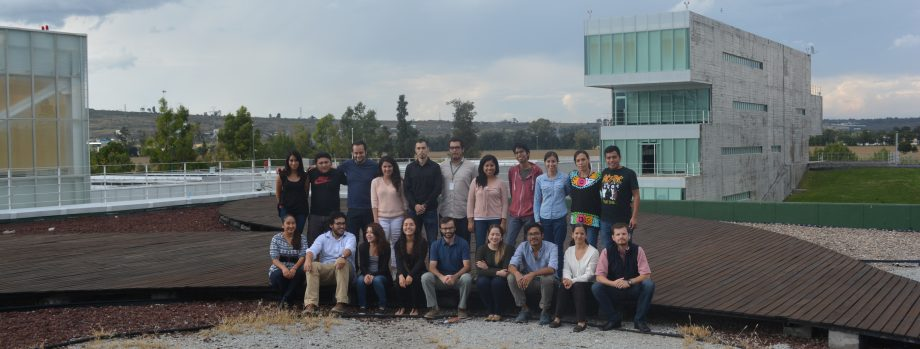

# EvoDivMet_L14
scripts de evodivmet
En este repositorio vamos a lamacenar los scripts del Laboratorio de Evolución ded la Diversidad Metabólica

El script mars nos permite crear carpetas de cada integrante en un directorio, es necesario usar bash y hay que darle una lista.txt
